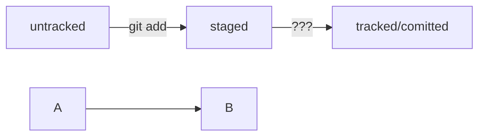

# Шпаргалки по изучению Git

## Это мой третий, но первый самостоятельный репозиторий (не по урокам, а по памяти/практике)


Создаю _локальные файлы_ и пушу их в _удаленный репозиторий_ на **GitHub** .

## учусь использовать Markdown

Заголовки можно создавать с помощью символа `#`. Чем больше `#`, тем меньше заголовок. Например:

# Заголовок первого уровня
## Заголовок второго уровня
### Заголовок третьего уровня

## Здесь учусь выделению кода

Чтобы выделить текст как код, поместите его в тройные кавычки `````. 

```
SETUP
Configuring user information used across all local repositories
git config --global user.name “[firstname lastname]”
set a name that is identifiable for credit when review version history
git config --global user.email “[valid-email]”
set an email address that will be associated with each history marker
git config --global color.ui auto
set automatic command line coloring for Git for easy reviewing
```
Отправить изменения на удалённый репозиторий — git push
Вы уже прошли весь «цикл коммита»: подготовили файлы с помощью git add, закоммитили их с комментарием командой git commit -m. Осталось загрузить содержимое локального репозитория на GitHub. За это отвечает команда git push (от англ. push — «толкать»).
В первый раз эту команду нужно вызвать с флагом -u и параметрами origin (имя удалённого репозитория) и main или master (название текущей ветки). Флаг -u свяжет локальную ветку с одноимённой удалённой. Как вы связывали локальный и удалённый репозитории в предыдущем уроке, так же и здесь нужно дополнительно связать ветки.


